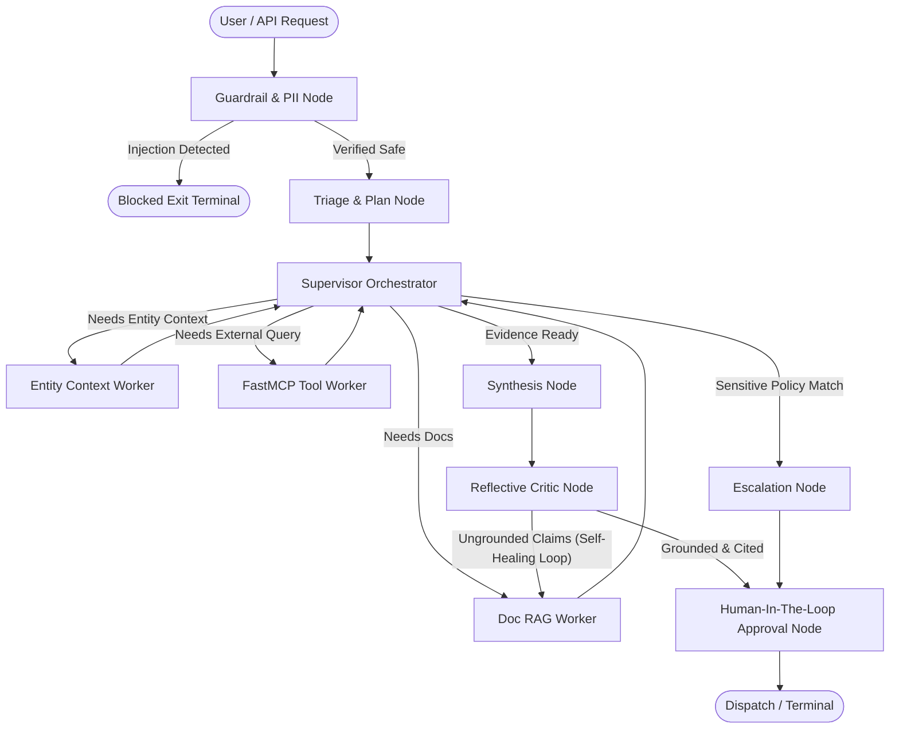
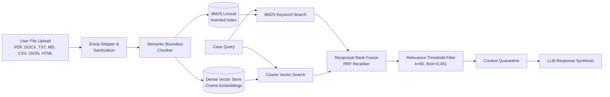

# Universal Document & Case Resolution Copilot

> A governed, domain-independent multi-agent AI copilot that ingests **any document or corpus** (PDF, DOCX, Markdown, TXT, CSV, JSON, HTML) along with dynamic entity metadata, autonomously analyzes cases, executes verified tool actions via FastMCP, and generates **grounded, cited resolution drafts for human approval**.

---

## Key Architecture Capabilities

1. **Domain Independent by Design**: Zero hardcoded domain rules. All domain intelligence is derived directly from ingested documents, entity records, and configurable policy YAMLs (`config/policies.yaml`).
2. **Universal Multi-Format Ingestion**: Auto-detects and structures `.pdf`, `.docx`, `.doc`, `.txt`, `.md`, `.csv`, `.json`, `.yaml`, and `.html` with structural boundary chunking.
3. **Corrective Hybrid RAG**: Combines BM25 lexical keyword search with Cosine Dense Vector search, fused via Reciprocal Rank Fusion (RRF) with relevance thresholds.
4. **LangGraph Multi-Agent Orchestration**: 10-node agent topology with specialized supervisor coordination, isolated worker tasks, and terminal human gatekeeper.
5. **Reflective Critic & Self-Healing Loop**: Dedicated critic verifies every factual claim against retrieved chunks. If ungrounded or citations are missing, it triggers an automatic corrective RAG loop with rewritten queries.
6. **Strict Human-in-the-Loop (HITL)**: The agent drafts and cites; it never auto-dispatches high-risk actions without explicit human operator sign-off.
7. **FastMCP Tooling**: Connects to external tools, catalogs, and databases over standard Model Context Protocol transports (`stdio`, `sse`, `ws`) with scope-based authorization.
8. **Tiered SQLite Persistence**: Embedded SQLite storage for Working Memory (scratchpad), Episodic Memory (entity history with LRU eviction), and Semantic Memory (domain facts).
9. **Dual Operation Mode**:
   - `LLM_MODE=offline`: Deterministic, zero-API-key simulation for CI/CD, tests, and offline benchmarks with 100% test pass rate.
   - `LLM_MODE=gemini` / `openai`: Live frontier LLM integration using your API key.

---

## Architecture Overview

### 1. Multi-Agent Orchestration Topology (LangGraph)



### 2. Universal Document Ingestion & Corrective RAG Pipeline



---

## Quickstart Guide

### 1. Environment Setup & Dependencies
```powershell
# Create virtual environment with Python 3.11
py -3.11 -m venv .venv
.\.venv\Scripts\Activate.ps1

# Install pinned dependencies
pip install -r requirements.txt
```

### 2. Generate Synthetic Multi-Domain Knowledge Base
```powershell
python scripts/generate_synthetic_data.py
```
This populates:
- `data/sample_docs/`: Sample multi-format documents (PDF, TXT, MD, CSV, JSON).
- `data/synthetic/`: Generic entities and historical support cases across IT, HR, Finance, Procurement, and Legal domains.
- `data/golden/`: Verified evaluation triplets for regression testing.

### 3. Run Automated Tests
```powershell
pytest -v
```
All 23 unit, integration, and end-to-end tests run deterministically offline and pass with a 100% pass rate.

### 4. Run Golden Set Benchmarks
```powershell
python scripts/run_benchmarks.py
```

### 5. Run the End-to-End Demo
```powershell
python run.py demo
```

### 6. Launch the Interactive Web UI
```powershell
python run.py web
```
The Streamlit interface opens at `http://localhost:8501`, featuring:
- **Upload & Manage Documents**: Drag-and-drop file uploader supporting PDF, DOCX, TXT, MD, CSV, JSON, YAML, HTML with real-time chunking, index stats, and "Clear All Documents" to start fresh with custom uploads.
- **Case Resolution & Chat**: Interactive query submission, multi-agent execution path visualization, cited resolution draft, and Human-in-the-Loop review buttons ("Approve & Dispatch", "Edit & Customize", "Escalate to Committee").
- **Policy Governance**: Inspection of active risk boundaries and escalation triggers.

---

## CLI Usage

### Ask a Single Question
```powershell
python run.py ask "What is our reimbursement window under corporate policy?" --entity ENT-1001
```

### Run FastMCP Server
```powershell
# Standard I/O transport
python run.py serve-mcp stdio

# SSE transport
python run.py serve-mcp sse
```

### Run Golden Benchmarks
```powershell
python run.py eval
```

---

## Live Frontier Model Integration (Gemini / OpenAI)

To enable live Google Gemini frontier generation:
1. Open `.env`:
   ```dotenv
   LLM_MODE=gemini
   GEMINI_API_KEY=your_gemini_api_key_here
   GEMINI_MODEL=gemini-3.6-pro-latest
   ```
2. Run any command:
   ```powershell
   python run.py ask "Summarize the vendor SLA contract terms"
   ```

---

## Repository Layout

```text
Agentic-RAG/
├── .env.example                    # Environment variable template
├── .gitignore                      # Git ignore configuration
├── Makefile                        # Common developer task automation
├── README.md                       # Master project documentation
├── requirements.txt                # Pinned production dependencies
├── run.py                          # Unified CLI entrypoint (demo, ask, serve-mcp, eval, web)
├── config/
│   ├── default_config.yaml         # Configurable thresholds, models & weights
│   └── policies.yaml               # Escalation triggers & risk categories
├── data/
│   ├── golden/
│   │   └── golden_set.jsonl        # Verified evaluation test cases
│   ├── sample_docs/                # Multi-format corpus (PDF, DOCX, TXT, MD, CSV, JSON)
│   └── synthetic/                  # Generic entity database & sample cases
├── docs/
│   ├── architecture.md             # System topology and node flow
│   ├── context-engineering.md      # Write, Select, Compress, Isolate guide
│   ├── evaluation-strategy.md      # Quality metrics and regression testing
│   ├── fastmcp-integration.md      # Tool definitions and transport guide
│   ├── memory-design.md            # SQLite tiered memory design
│   ├── owasp-llm-security.md       # OWASP LLM Top 10 mitigation matrix
│   └── traceability-matrix.md      # Requirements verification matrix
├── evals/
│   ├── baselines/                  # Quality baseline targets
│   ├── metrics.py                  # Faithfulness & citation recall formulas
│   └── prompt_regression.py        # Automated regression runner
├── scripts/
│   ├── generate_synthetic_data.py  # Seeded reproducible data generator
│   └── run_benchmarks.py           # Benchmark runner
├── src/
│   └── universal_copilot/
│       ├── config.py               # Centralized settings & YAML loader
│       ├── schemas.py              # Pydantic boundary contracts
│       ├── state.py                # Typed LangGraph CaseState
│       ├── cli.py                  # Argument parser for CLI
│       ├── context/                # Context engineering (quarantine, pruning, compression, assembler)
│       ├── guardrails/             # PII redaction & prompt injection detector
│       ├── ingestion/              # Multi-format document loader & structural chunker
│       ├── rag/                    # Corrective hybrid BM25 + Vector retriever & RRF reranker
│       ├── memory/                 # Working, episodic (LRU), and semantic SQLite persistence
│       ├── mcp/                    # FastMCP server, client, scopes & dynamic tools
│       ├── graph/                  # LangGraph topology, runner, and 10 agent nodes
│       ├── llm/                    # Dual offline simulation + live Gemini provider & cache
│       └── ui/                     # Interactive Streamlit Web application
└── tests/                          # 23 comprehensive pytest test suites (100% passing)
```

---

## Security & Governance (OWASP LLM Top 10)

- **LLM01 (Prompt Injection)**: Pattern detector identifies jailbreaks and routes directly to `blocked_exit`.
- **LLM02 (Sensitive Data Leakage)**: PII detector scrubs emails, phones, SSNs, and credit cards with reversible mapping.
- **LLM06 (Excessive Agency)**: Hard constraint against auto-dispatch. All actions require human operator sign-off at `hitl_approval_node`.
- **Indirect RAG Injection Defense**: All retrieved chunks are isolated within `<untrusted_content>` tags to prevent context manipulation.
