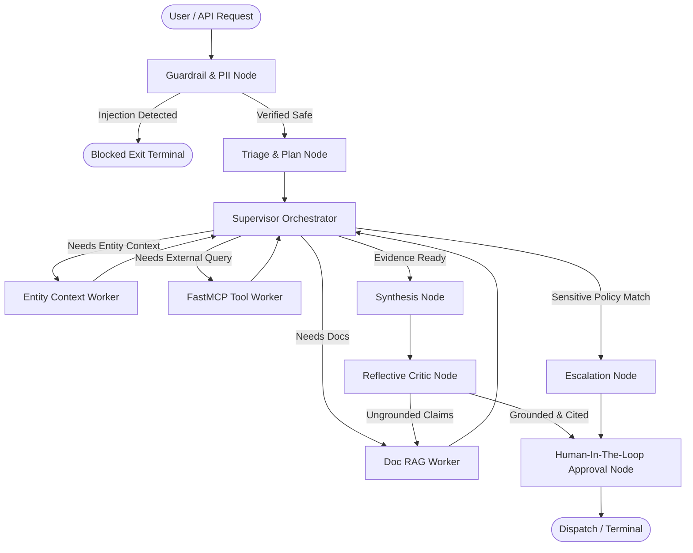

# System Architecture: Universal Document & Case Resolution Copilot

## 1. Architectural Overview

The **Universal Document & Case Resolution Copilot** is an enterprise-grade, domain-independent multi-agent architecture built on **LangGraph**, **FastMCP**, and **Corrective Hybrid RAG**.

The system enables users to ingest documents across arbitrary formats and domains without hardcoded rules. Business rules, SLA terms, escalation policies, and factual grounding are extracted dynamically from documents and configurable policies (`config/policies.yaml`).

---

## 2. Core Subsystems

### 2.1. Multi-Agent LangGraph Orchestration
- **Guardrail Node**: Intercepts prompt injection attacks and redacts sensitive PII entities before intelligence dispatch.
- **Triage Node**: Classifies query intent and maps dependencies.
- **Supervisor Node**: Centrally coordinates worker execution without allowing workers to speak directly to each other, maintaining strict state governance.
- **Specialist Workers**:
  - `Doc RAG Worker`: Executes BM25 + Cosine Dense Vector retrieval with Reciprocal Rank Fusion.
  - `Entity Context Worker`: Queries entity and user attributes via FastMCP.
  - `MCP Tool Worker`: Invokes authorized external tool endpoints.
  - `Escalation Node`: Halts auto-dispatch and routes policy violations to compliance teams.
- **Synthesis Node**: Formulates cited drafts with explicit bracketed source citations `[Doc: filename, Section: X]`.
- **Reflective Critic Node**: Cross-checks factual assertions against retrieved chunks. If citations are missing or claims are ungrounded, triggers a corrective loop back to the RAG worker with rewritten queries.
- **HITL Approval Node**: Terminal gatekeeper formatting drafts, diffs, and audit events for human operator sign-off.

### 2.2. Universal Multi-Format Ingestion
Supported formats:
- **PDF** (`.pdf`): Extract text streams and page coordinates using `pypdf` with raw stream fallback.
- **Word** (`.docx`, `.doc`): Extract paragraphs and tables using `python-docx` with XML fallback.
- **Markdown & Text** (`.md`, `.txt`): Parse structured heading hierarchies and horizontal rules.
- **Tabular Data** (`.csv`): Converts tabular rows into structured schema representations.
- **JSON & YAML** (`.json`, `.yaml`): Extracts hierarchical key-value facts.
- **Web Pages** (`.html`): Strips scripts and tags, converting headings to structural sections.

### 2.3. Corrective Hybrid RAG
- **BM25 Lexical Search**: Keyword-dense clause matching using `rank_bm25`.
- **Dense Vector Search**: High-dimensional semantic embeddings (SentenceTransformers with deterministic hash fallback).
- **Reciprocal Rank Fusion (RRF)**: Merges rank scores:
  $$RRF(d) = \sum_{m \in \{bm25, vector\}} \frac{w_m}{k + \text{rank}_m(d)}$$

### 2.4. Multi-Tiered SQLite Persistence
1. **Working Memory**: Active thread step scratchpad.
2. **Episodic Memory**: Per-entity case interaction history with LRU eviction.
3. **Semantic Memory**: Reference facts, definitions, and domain rules.
4. **Audit Logs**: Immutable compliance trails.
