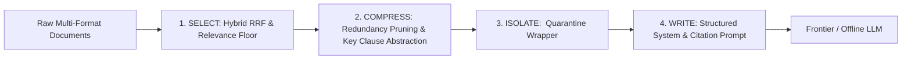

# Context Engineering: Write, Select, Compress, Isolate

## 1. Context Engineering Principles

The **Universal Document & Case Resolution Copilot** implements the four core pillars of Context Engineering to guarantee high fidelity, cost efficiency, and defense against indirect prompt injection.



---

## 2. The Four Pillars

### 2.1. SELECT (Hybrid Retrieval & RRF)
- Combines lexical keyword precision (**BM25**) with dense semantic vectors (**Cosine similarity**).
- Merges ranked candidates through Reciprocal Rank Fusion ($k=60$):
  $$RRF(d) = \frac{w_{bm25}}{60 + \text{rank}_{bm25}(d)} + \frac{w_{vec}}{60 + \text{rank}_{vec}(d)}$$
- Applies a `relevance_floor` threshold (0.001) to eliminate noisy or unhelpful chunks.

### 2.2. COMPRESS (Pruning & Token Budgeting)
- **Line & Header Deduplication**: Strips redundant corporate headers and boilerplate text across adjacent chunks (`pruning.py`).
- **Numerical & Constraint Preservation**: Prioritizes sentences containing currency symbols (`$`, `€`), percentages (`%`), dates, and SLA timeframes (`days`, `hours`).
- **Strict Budgeting**: Context assembler constrains total assembled evidence to 3,000 tokens to avoid attention degradation in LLM needle-in-a-haystack tasks.

### 2.3. ISOLATE (Untrusted Content Quarantine)
- All external data—user queries, uploaded PDFs, CSV records, and third-party API payloads—are strictly wrapped inside:
  ```xml
  <untrusted_content source="evidence_1">
  [Extracted chunk content here]
  </untrusted_content>
  ```
- Boundary delimiters are escaped to prevent tag breakout attacks (indirect prompt injection / OWASP LLM01).

### 2.4. WRITE (Grounded Citation Prompting)
- Instructs the model to answer only using facts within `<untrusted_content>` tags.
- Enforces strict bracketed citations: `[Doc: filename, Section: X, Page: Y]`.
- Output is verified by a dedicated **Reflective Critic node** before reaching human review.
