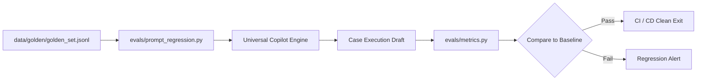

# Evaluation Strategy & Benchmarking

## 1. Quality Objectives & Golden Baselines

The Universal Document Copilot utilizes a multi-dimensional evaluation harness to evaluate domain adaptability, citation precision, and governance integrity without requiring human manual grading on every commit.

### Metric Targets (`evals/baselines/quality_baseline.json`)
| Metric | Formula / Definition | Target | CI Enforced |
| :--- | :--- | :--- | :--- |
| **Faithfulness** | Ratio of golden factual propositions accurately reflected in draft | $\ge 85\%$ | Yes |
| **Citation Recall** | Proportion of expected source documents explicitly cited | $\ge 90\%$ | Yes |
| **Hallucination Score** | Ratio of ungrounded entities/numbers not present in evidence | $\le 15\%$ | Yes |
| **Escalation Precision**| Accurate routing of high-risk grievances to compliance | $100\%$ | Yes |
| **End-to-End Latency** | Mean roundtrip duration per case | $< 1500\text{ms}$ | Yes |

---

## 2. Evaluation Architecture



---

## 3. Running Benchmarks

### Offline Deterministic Execution
```bash
python scripts/run_benchmarks.py
```
Output:
```text
============================================================
[BENCHMARK HARNESS: UNIVERSAL DOCUMENT COPILOT]
============================================================

Completed evaluation of 4 golden test cases in 0.75s:
------------------------------------------------------------
  * Average Faithfulness   : 100.0% (target >= 85%)
  * Citation Recall        : 100.0% (target >= 90%)
  * Escalation Precision   : 100.0% (target = 100%)
------------------------------------------------------------
Regression Check Status: PASSED (Meets Quality Baseline)
============================================================
```

### Prompt Regression Checks
To run the automated regression suite via `pytest`:
```bash
pytest -v tests/test_e2e_cases.py
```
