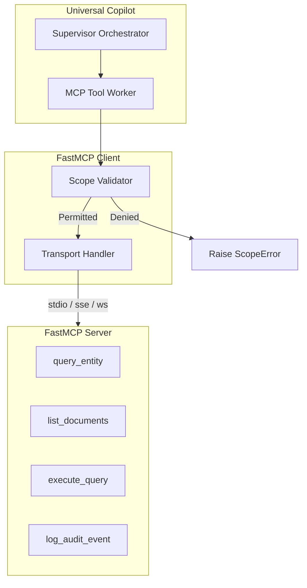

# FastMCP Server & Client Integration

## 1. Overview

The **Universal Document Copilot** implements the **Model Context Protocol (FastMCP)** to decouple the AI agent from backend data stores, corporate catalogs, and external APIs.



---

## 2. Exposed Tools & Capabilities

| Tool Name | Parameters | Required Scope | Description |
| :--- | :--- | :--- | :--- |
| `query_entity` | `entity_id: str` | `read:entity` | Retrieves structured attributes, role, security clearance, and past cases for an entity. |
| `list_documents` | None | `read:docs` | Returns catalog metadata (filename, size, extension, modified timestamp) for ingested corpus. |
| `execute_query` | `query: str` | `execute:query` | Runs structured filters on tabular and catalog records (CSV, JSON). |
| `log_audit_event` | `event_type: str`, `user_or_entity: str`, `details: dict` | `write:audit` | Appends an immutable compliance audit record to SQLite persistence. |

---

## 3. Scope-Based Access Control

Fine-grained scopes prevent privilege escalation:
```python
from universal_copilot.mcp.client import MCPClient
from universal_copilot.mcp.scopes import ScopeError

# Client restricted to read-only document access
read_only_client = MCPClient(granted_scopes=["read:docs"])

# Allowed
docs = read_only_client.call_tool("list_documents")

# Blocked with ScopeError:
try:
    read_only_client.call_tool("log_audit_event", event_type="unauthorized", user_or_entity="ENT-1001", details={})
except ScopeError as e:
    print(f"Enforced scope security: {e}")
```

---

## 4. Running the FastMCP Server

### Standard I/O (Default)
```bash
python run.py serve-mcp stdio
```

### Server-Sent Events (SSE)
```bash
python run.py serve-mcp sse
```
