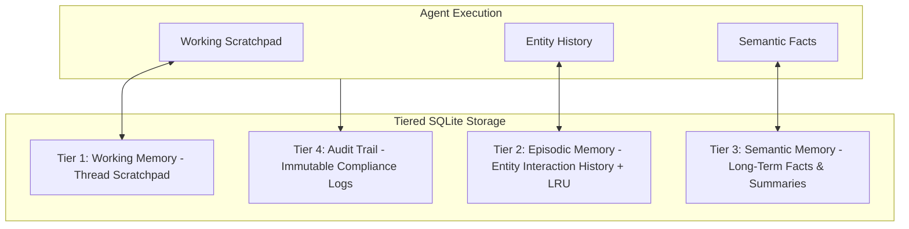

# Tiered Memory Architecture: SQLite Persistence

## 1. Multi-Tiered Memory Hierarchy

The Universal Document Copilot provides persistent state across three isolated operational tiers backed by an embedded, thread-safe SQLite database (`data/storage/copilot_memory.sqlite`) operating in WAL (Write-Ahead Logging) mode.

---

## 2. Memory Tier Details

### 2.1. Tier 1: Working Memory (Thread Scratchpad)
- **Scope**: Active execution thread (`thread_CASE-XXXXX`).
- **Lifecycle**: Written sequentially as agent nodes execute. Cleared or archived upon case resolution.
- **Table**: `working_memory` (`thread_id`, `case_id`, `step_index`, `node`, `thought`, `findings`, `created_at`).

### 2.2. Tier 2: Episodic Memory (Entity History & LRU)
- **Scope**: Scoped per `entity_id` (e.g. employee, vendor, or customer ID).
- **Eviction**: Bounded LRU eviction (`max_episodes_per_entity=25`). Oldest unaccessed interactions are automatically evicted when capacity is reached.
- **Table**: `episodic_memory` (`entity_id`, `case_id`, `summary`, `metadata_json`, `last_accessed`, `created_at`).

### 2.3. Tier 3: Semantic Memory (Domain Facts & Knowledge)
- **Scope**: Global system level.
- **Lifecycle**: Retains persistent definitions, SLA targets, and handbook summaries across runs.
- **Table**: `semantic_memory` (`key`, `category`, `content`, `source_doc`, `embedding_json`, `updated_at`).

### 2.4. Tier 4: Immutable Compliance Audit Logs
- **Scope**: Global compliance audit trail.
- **Lifecycle**: Append-only log recording every case intake, sensitive policy trigger, and human review sign-off.
- **Table**: `audit_logs` (`event_id`, `event_type`, `user_or_entity`, `details_json`, `timestamp`).
